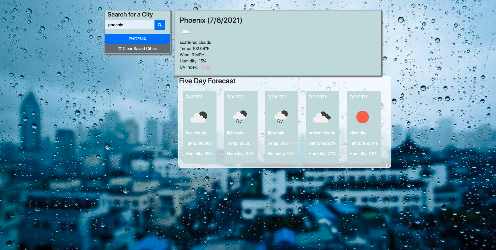

# Work Day Calendar

# Link to Application
[VIEW MY APPLICATION HERE!](https://chris31roc.github.io/weather-app/)

## Table of Contents

* [Description](#Description)
* [Author](#Author)
* [Technologies Used](#Technologies#Used)

## Description
 
Weather App is an application using OpenWeather API, which is a third-party API that will allow access to weather data to build a weather dashboard for a five-day forecast that will run in the browser and feature updated HTML, CSS and JavaScript/jQuery. The user can search for a city and will be presented with the current and future conditions for that city. The city name, the date, an icon representation of weather conditions, the temperature, the humidity, the wind speed, and the UV index colored according to the index level (Green="Low", Yellow="Moderate", Orange="High", Red="Very high" and Violet="Extreme") will be displayed. The user can also view a 5-day forecast that displays the date, an icon representation of weather conditions, the temperature, and the humidity for that city. That city is then added to the search history. The user can view current weather conditions for that saved city with just one click.

## Author

**Christopher Hicks**

- Github: [chris31roc](https://github.com/chris31roc)

- Email: chris31roc@yahoo.com

## Technologies Used

- HTML

- CSS

- JavaScript/jQuery